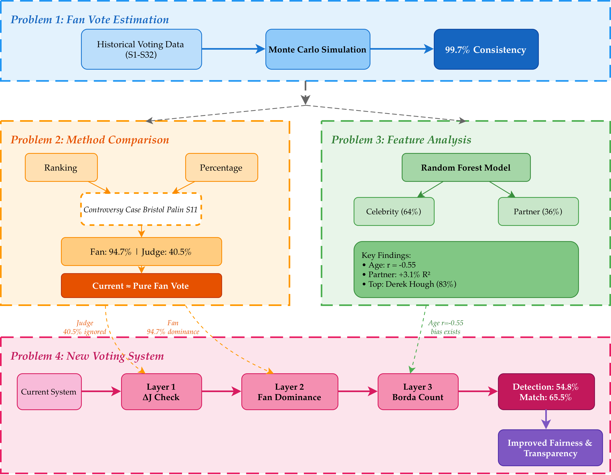

## 使用 LaTeX

中频率使用了一年的 Typst，最终还是认为 Typst 目前还没发展到让我放心使用的地步。

- 排版效果不如 $\LaTeX$

- 便捷性不如 markdown

- AI 亲和性上：markdown $\geq \LaTeX \geq$ typst.

### 模板选用

#### 日常作业/实验报告

使用 NorthSecond 学长的 [中山大学非官方的报告文学模板](https://github.com/NorthSecond/SYSU_Latex_Template)。

##### 绘图

最基础的自然是 mermaid.js 通过 pdf 格式嵌入 $\LaTeX$ 文档中。

tikz 是一个不错的选择，vibe coding 能够得到很不错的效果，只需要略微调整文字错位。

如果遇到那种不太容易做出来的图，还是建议选用 visio, powerpoint 作图（力大砖飞）.

> 更新于 2026-02-13T23:35:37：
>
> 可以试试  [next-ai-draw-io](https://github.com/DayuanJiang/next-ai-draw-io) 这个 mcp进行绘图，效果类似：
>
> 

#### Slide

目前有两个 star 较高的项目：

- [中山大学PPT模板](https://github.com/Nelson-Cheung/SYSU-beamer-template)

- [SYSU Beamer Template](https://github.com/yxnchen/sysu-beamer-template)

就个人使用体验而言，**前者**大于后者。

##### 嵌入视频

PostScript 给予了 PDF 文件强大的表达能力 <del>其实 pdf 里面可以塞虚拟机哦</del>[^1]，但是 $\LaTeX$ 去整这种花活其实不太适合而且也存在兼容性和安全性的问题[^2]。

所以，一个推荐的解决方案是使用 `multimedia` 包对外部媒体进行引用。

### 平台选用

在线平台的编译速度慢但是写作能力强，本地部署计算资源丰富但是不方便同步和协作。

#### 在线平台

Overleaf, TeXPage.

校内部署的 sysu overleaf 服务。

#### 本地部署

自从用习惯了 RDP 后基本没裸机直接使用 Linux 进行工作了。

这里以 Windows 下的配置为例子。

参照：

- [Ubuntu 最小化安装 Texlive 指南](https://www.arong-xu.com/posts/texlive-2025-minimal-install-with-cmd-on-ubuntu/)
- [Linux下安装TeXLive并配置VSCode中tex编写环境（2024最新）](https://www.m0rtzz.com/posts/4)

并将 Windows 的字体导入 WSL 即可。

## 使用 Typst

### 前情提要

虽然我认为 typst 远远没有到能够替代 $\LaTeX$ 的程度，但是 typst 够新，以至于它有很多有趣的东西：比如 typst 编译为 html 生成网站，比如**生成小红书笔记**。

这是 $\LaTeX$ 社区的生态也未曾占领的生态位。

### 模板选用

#### 作业/实验报告

长期使用 [GZ-Typst-Templates](https://github.com/GZTimeWalker/GZ-Typst-Templates)，但是年久失修，考虑日后自行修改使用。

#### Slide

有个中国人主导开发的类 Beamer 产物 [Touying](https://touying-typ.github.io/zh/docs/intro/)，我转专业的 Slide 就是它做的。

#### 小红书

自己魔改的模版 [typst-rednote](https://github.com/Candlest/typst-rednote)，效果如下：

<table border="0" cellpadding="0" cellspacing="0" width="100%" style="table-layout: fixed; border-collapse: collapse;">
  <tr>
    <td width="50%" style="padding: 0; border: none;">
      
    </td>
    <td width="50%" style="padding: 0; border: none;">
      
    </td>
  </tr>
</table>

### 平台选用

#### 在线协作

typst.app，也就是官方平台。界面现代，免费协作。

#### 本地部署

使用 Cargo 安装 typst，然后在 VS Code 上安装插件 tinymist 即可。

---

[^1]: [linuxpdf](https://github.com/ading2210/linuxpdf)

[^2]: [Can PDFs have viruses?](https://www.adobe.com/acrobat/resources/can-pdfs-contain-viruses.html)
