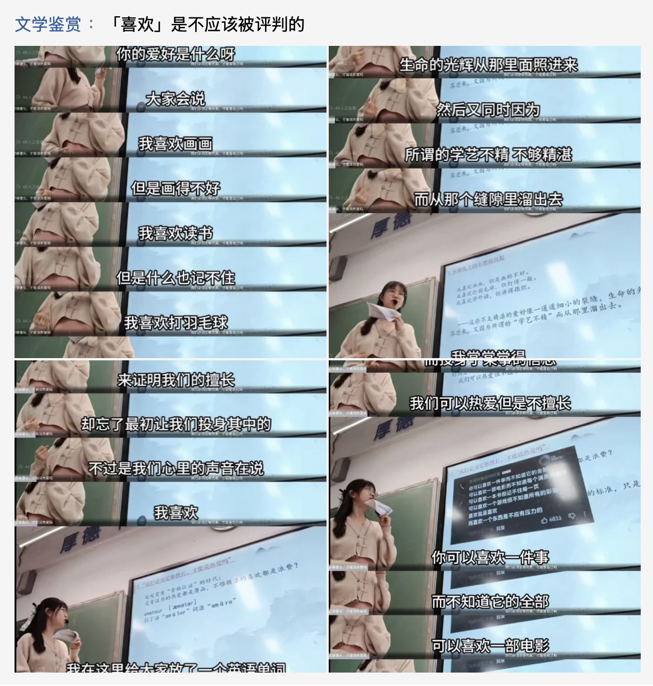
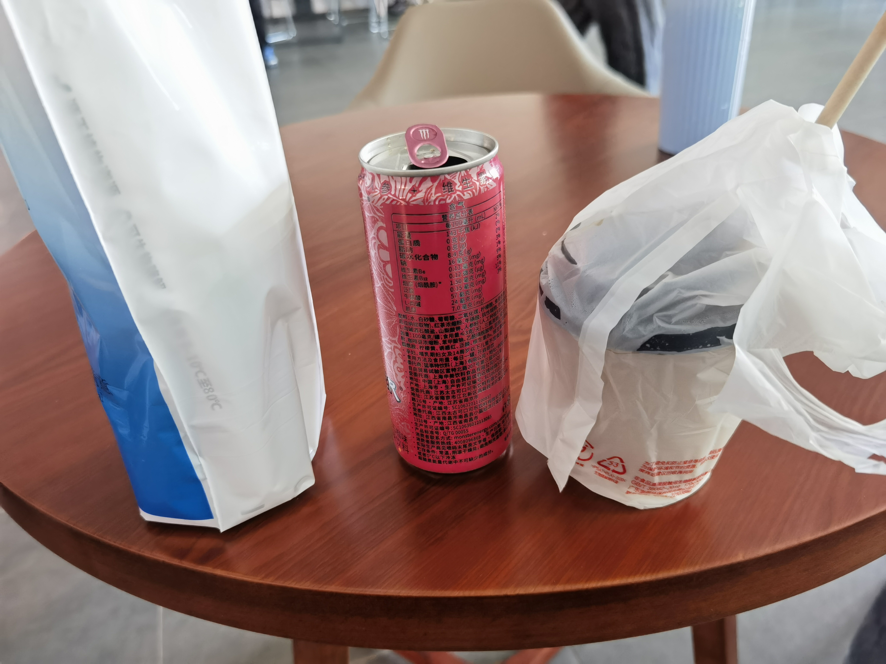
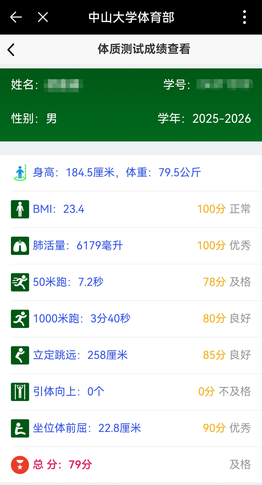

想说的东西很多，却不知从何开始。

想做的事情很多，也许只能在 Feedback Loop 中串行探索。

## 学业：喜欢与擅长

### 成绩

在大学的一年半里，我感受到诸多落差，比如「英语四级才刚上500」，比如「数理基础确实比较薄弱」，比如「你鸭理医工各种专业学过信息竞赛，有着扎实的计算机童子功的人不少」，其中有些落差仍在尝试追赶，有些落差已经彻底接受——各种各样的积淀，是我永远无法企及的。

不过，「世界上没有两片相同的叶子」。在过去的一年半里面，我给自己的定位是「喜欢计算机，并愿意为接近它献出很多」（怎么听起来那么像不择手段的蛆）。

是的，我没有天赋，我没有积累（除了孩童时期开始的野路子开发，这一点积累马上要完全被 AI 的进步吞噬）。但是我相信自己是有热爱的。

> 「我喜欢计算机」

这个观点，变成了我行动的公理。我可以为它找到很多的论据，但是同时也能找到很多可以推翻它的点，其中之一便是我的绩点——这个在国内大学本科评价体系中占据重要地位的指标。

期末考的前几天我还在打 CTF，去学一些和绩点评价体系无关的东西，去为几个水课里面我很感兴趣的东西花费了大量的时间探索。

元旦的时候，我真的很「不安です」我害怕，害怕就算转到计算机专业，我也不能在那些我所熟悉的领域拿到高分，害怕自己在计算机领域的自尊心被彻底击碎。

于是在期末考的前几天，我转发了这个：

一方面是给我自己打气，一方面也是「立体机动防御」，万一真的绩点倒数也能告诉自己不要气馁。<del>活下去。</del>

好在虽然确实绩点一般，并不算很好，但是也不算太差。💦

总之，为了这份暂且不可论证的「喜欢」，**继续活下去吧**！

### 科研

感觉一切都刚刚入门（甚至还没入门！），再探再报。

## CTF：断线重连

这个学期只参加了两场 CTF，一场是三校的新手赛，一场是长城杯的初赛。前者拿到了校内第二，总排第四；后者则是反作弊系统杀疯了，勉强跻身半决赛。

我不能永远是新手，我不能永远是三天晒网两天打渔。

接下来应该每周会抽出一点时间来学 pwn，真的走出去看看。

## 生活

在这个学期之中，我不再有转专业的压力。即便有着就业升学等不确定性的事情压在我的心头，我也有着足够的动力去尝试一些新的东西。

也许，我的大学生活在这个学期才真正开始。<del>虽然过不了多久就要结束了。</del>

### 交往

#### 稳定安全的关系

尝试带给好朋友更多正面的情绪，更多新奇有趣的事物。（感谢和我一起过元旦的你！）

遇到了非常非常非常好的舍友，很温和地相互包容。但是我如何为这个环境献出一份力呢？

网安院有趣的同学不少（长发乐队男，健身大手子……），小登老登，都算很好相处。

总之，在这个学期，突然感觉有了「稳定安全的关系」，整个人都松弛了不少。

#### 尝试和陌生人聊天

> 人在同一时间，最多能维护 150 人左右的联系。

我很喜欢那种能够接触各种各样的人的工作/活动，让我能够可以接触不同的世界，防止「过拟合」。

尝试跨出自己的小世界，参加一些奇怪的活动，去加一些陌生人，去聆听别人的叙事。

### 健康

今年的春节，我对所有人的祝福都包含了一句「身体健康」。

随着年龄增长，我逐步意识到：人的身体是一台不可更换的，会折旧的机器。

陪着妈妈去做手术……陪着中风恢复的奶奶去查肝功能……

一个不健康的身体，不只是每天都要带来一笔额外的支出（老年慢性病），更是精力和锐气的折损。

健康。身体健康。

祝看到这里的你「身体健康」。

#### 体重

身高 184.5cm，作为一个青春期大部分时候都在家/教室/宿舍，宅着的人，在经历高三一年的迷惘后体重直达到了 86kg。

转专业的那一年，除了校园跑，我基本没怎么运动。不过还是在 7 月的深圳校区发现自己已经减到了 80kg。

在大二上这个学期，体重偶有波动，基本维持在 78～80kg 这个区间。

这个寒假最初定下的目标是减到 75 kg，不过截至目前（2.22），体重是 76.6kg。并没有做太多运动<del>除了打舞萌</del>，只是单纯每顿吃到 7 分饱就停嘴。

也许下一步是抛开 bmi 这个宽泛而不准确的工具，设立一两个优化目标，对自己的身体指标进行进一步的管理。

#### 跑步：最有快感

跑步也许是性价比最低的运动（投入时间上），但是却是最简单，最能带来快感的运动。

景物的飞速后移压抑杏仁体产生焦虑，

内啡肽分泌抵抗痛苦忍受更多。

10 月 3 km/天 雷打不动，即便是后续变忙断跑 2 个月，我仍然能在 1 月跑出 10 km 六分二十多的配速。

而在期末的连续通宵之中，跑步让我可以稍微更加肆无忌惮地使用各种提神药物。

比如通宵复习信安数学，只睡4小时考马原：

#### 健身：引体向上意难平

**希望** 2026 年上半年的体测，引体能拿下 5 个！

